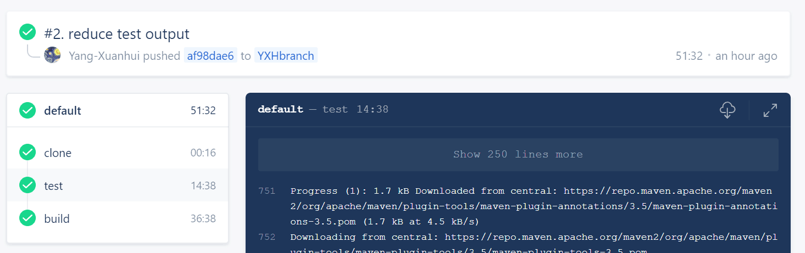

## Milestones Ⅱ　CI实现

### 1. 搭建CI平台

​		本次作业我们使用了Drone工具，采用了 **Multi-Machine** 模式，在云服务器端 <http://106.12.89.107> 搭建了基于docker的CI平台，成功实现了持续集成（CONTINUOUS INTEGRATION）。

### 2. 布局

#### 2.1 创建 OAuth Application

​		于github中创建一个新的[OAuth Application](https://github.com/settings/applications/new)其中 **Homepage URL** 与 **Authorization callback URL** 填写服务器地址

#### 2.2 在服务器端启动Drone服务

​		在服务器端docker内运行

```
docker run \
  --volume=/var/run/docker.sock:/var/run/docker.sock \
  --volume=/var/lib/drone:/data \
  --env=DRONE_GITHUB_SERVER=https://github.com \
  --env=DRONE_GITHUB_CLIENT_ID= \
  --env=DRONE_GITHUB_CLIENT_SECRET= \
  --env=DRONE_AGENTS_ENABLED=true \
  --env=DRONE_RPC_SECRET= \
  --env=DRONE_SERVER_HOST= \
  --env=DRONE_SERVER_PROTO= \
  --env=DRONE_TLS_AUTOCERT=true \
  --publish=80:80 \
  --publish=443:443 \
  --restart=always \
  --detach=true \
  --name=drone \
  drone/drone:1
```

​		小组内成员访问 <http://106.12.89.107> 即可将自己的github账号关联drone服务。

#### 2.3 配置相关.drone.yml文件，实现CI

​		本地repo内配置添加.drone.yml文件，配置完成。以后小组成员每次push后，即可在服务器端实现自动测试和构建。

```
    
kind: pipeline
name: default
steps:
  - name: test
    image: openjdk
    image: maven
    commands:
      - cd wordladder
      - mvn test
    when: 
      event: push
  - name: build
    image: openjdk
    image: maven
    commands:
      - cd wordladder
      - mvn clean package
    when:
      event: push
```

### 3. 失败尝试
在完成Sample前有一些有普遍参考价值的失败原因，以下是我们组在尝试过程中遇到过情况：
#### 3.1 测试失败
由于测试失败会收到daemon的Error response，无法进行pull request，图示如下：


#### 3.2 缺失run drone/agent
我们在完成了第一次部署后，在push后一直显示的是pending状态。<br>
实际上，如果在多服务器模式下运行Drone，则需要安装一个或多个代理。
代理程序是安装在服务器实例上的小型程序，它接收来自中央Drone服务器的指令以执行构建管道。
这是允许跨多台计算机扩展CI / CD基础结构。<br>
具体可以根据服务器类型参考Drone官方的 [Administration Guide - Agents](https://docs.drone.io/administration/agents/?tdsourcetag=s_pctim_aiomsg)


### 4. Sample

​		本次作业以组内杨宣慧 HomeworkⅡ 的代码作业样例，push到服务器端，样例clone, test, build均成功。截图如下：




### 5. Reference

<https://docs.drone.io/installation/github/multi-machine>

https://www.cntofu.com/book/139/cases/ci/drone.md

